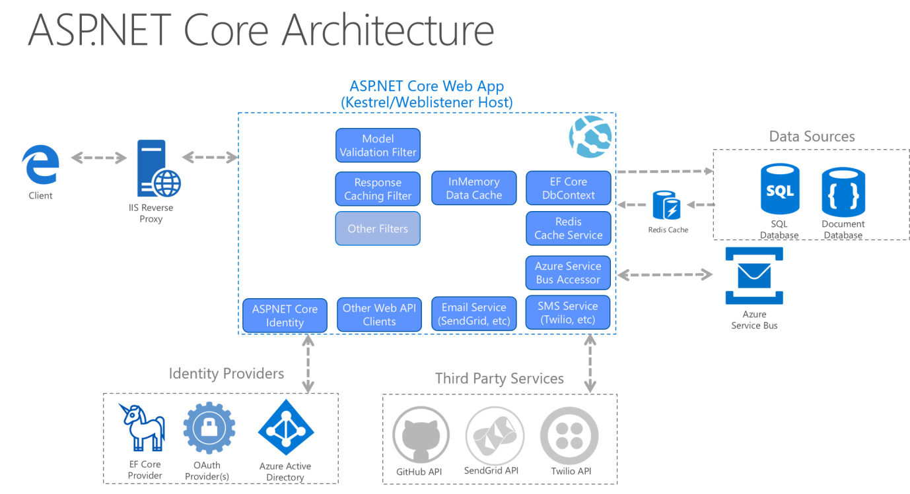

# .NET Core 架構

ASP.NET Web 應用程式架構，本文參考依據 .NET 3.1 與 .NET 5.0 相關文獻整理

+ [架構原則](https://docs.microsoft.com/zh-tw/dotnet/architecture/modern-web-apps-azure/architectural-principles)
+ [一般 Web 應用程式架構](https://docs.microsoft.com/zh-tw/dotnet/architecture/modern-web-apps-azure/common-web-application-architectures)
+ [Advanced Architecture for ASP.NET Core Web API](https://www.infoq.com/articles/advanced-architecture-aspnet-core/)

## 架構原則

## ASP.NET 應用程式架構

## 應用程式層級

+ [User Interface]()，應用程式介面層，基於 Routes、Controller 物件設計的對外介面。
+ Business Logic，商業邏輯層，實際的介面內服務邏輯與演算法，亦可用 Service Modules、Domain Model 來稱呼。
+ [Data Access](../app/WebService.Entities/readme.md)，資料存取層，將邏輯與演算產生的數據，經由資料存取層回寫至相對應的資料源，基於 Entity Framework Core 物件設計的資料存儲物件。
