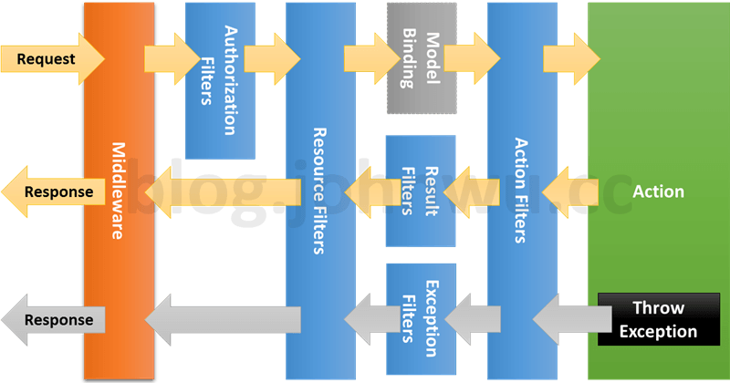

# .NET Core 應用程式生命週期

對於任何應用程式框架而言，依據其依循的架構概念、設計用途，可以區分為兩種類型：

+ 被動運作的函式庫集
+ 主動運作的樣板框架

前者顧名思義就是提供一個針對特定演算法的函式庫集，例如 OpenCV，後者是提供一個框架進入點，並依據編寫的類別、行為，來完整運作後的成果；而 .NET Core 應用程式便是一種主動運作的樣板框架，而此類樣板框架的運用原則，便是提供開發人員一系列的類別繼承 ( Inheritance )、行為覆載 ( Override )，框架則基於此樣板的演算原則來觸發類別與行為，而這個演算原則便稱呼為應用程式生命週期；對於可進行編譯的語言，具體可分為兩種生命週期：

+ 編譯生命週期：程式在編譯前會依據設定對引入專案與設定專案有關的處理週期，主要用於 CI/CD 與相關整合設計
+ 執行生命週期：軟體編譯後並執行，在啟動其服務至收到需求並執行的處理週期，依據語言、框架將會存在複數的週期設計

## 應用程式生命週期

基於文獻所述，ASP.NET MVC Core 約莫存在三個生命週期：

+ 初始應用週期
+ 需求處理週期
+ 相依注入週期

### 初始應用週期

.NET Core 應用程式為一個標準 Web 伺服器服務，因此再啟動並初始一個基於 .NET 的伺服器服務會如下圖程序步驟執行：


在 .NET 專案的程式進入點 ```Main()``` 中可以看到一句服務建置步驟：

```
CreateHostBuilder(args).Build().Run();
```

而這句可以分解為下列三句，並分別對應在上圖的建置、執行的程序：

```
var hostBuilder = CreateHostBuilder(args);
var host = hostBuilder.Build();
host.Run();
```

在建置程序中，開發人員需定義 ```Startup``` 中的 ```ConfigureServices``` 以此設定服務的相依注入設定，而關於 ```HostBuilder```、```WebHostBuilder``` 則是用於定義服務建置工具，主要會用於動態建置程序與基礎服務設定。

在執行程序中，開發人員需定義 ```Startup``` 中的 ```Configure``` 以此設定需求處理週期中需執行的服務，需注意在此函數中的參數是相依注入近來，因此應依據管理需要而調整注入的參數。

### 需求處理週期

.NET Core 應用程式的依據版本的生命週期在其細節會有差異，詳細參考文獻連結，在此引用整理後的流程進行說明。


如上圖所示，ASP.NET MVC Request 生命週期：

+ Middleware

中間件 ( Middleware ) 在整個應用程式流程中，用於處理用戶定義的需求資訊前處理工作，設定於此的元件將會對每個進來的需求做統一的處理。

+ Routing

路由 ( Routing ) 是一個由 MVC 框架定義的中間件，此元件用於將需求分配到對應的控制器 ( Controller ) 與行為 ( Action )，而分配標準則依據約定路由 ( Convention routes ) 或屬性路由 ( Attribute routes )

+ Controller Initialization

初始化控制器，在此階段 MVC 框架會基於非同步任務 ( Task ) 來初始化控制器，並讓控制器處裡需求，但需注意，控制器會執行最接近需求的路由模板所對應的行為。

+ Action Method Execution

在完成控制器初始化並開啟任務後，MVC 框架便會執行行為並取得執行結果。

+ Resutl Execution

MVC 框架取回執行結果後，會依據回應物件分為資料結果、呈現結果，前者為 HTTP Response，後者會經過呈現繪圖 ( View Rendering ) 轉為 HTML Response。

<center>
    
</center>

> from [Detailed ASP.NET MVC Pipeline](https://www.dotnettricks.com/learn/mvc/detailed-aspnet-mvc-pipeline)

詳細生命週期處裡細節可參考上圖所示內容，而對開發人員來說，實務設計會著重在：

+ Middleware，設計全域行為
+ Action，區域過濾器、行為邏輯設計
+ Result，回應格式、頁面設計

### 相依注入週期

.NET Core 應用程式其架構原則中有一項規範『相依性反轉』，因此，在整個服務的設計原則中有大量的相依注入 ( Dependency Injection )，其運作週期如下：

<center>
    
</center>

> from [ASP.NET Core 3 系列 - 依賴注入 (Dependency Injection)](https://blog.johnwu.cc/article/asp-net-core-3-dependency-injection.html)

相依注入其觀念是避免在編譯其決定物件間的關係性，讓物件的關係留待執行階段再指定，以此達到類別的關係解耦；其優點是讓物件的關係更為靈活，亦可基於設定改寫關係定義並有原則的抽象類別，其缺點則是物件生成關係是隱含在框架生命週期中，閱讀與維護性會受知識與觀念影響。


而依據前文所述，開發人員在 ```Startup``` 中的 ```ConfigureServices``` 定義的相依注入，其定義時會需指定注入物件的生命週期，範圍如上圖所示：

+ Transient : 每次請求時都會產生新的 Instance

每個物件生成並依據類別定義注入物件時，會對框架產生一次注入請求，指定為 ```Transient``` 的物件，在請求時便會生成一個 Instance。

+ Scoped : 每個 Request 都會產生一份 Instance

伺服器收到請求 ( Request ) 從而建立控制器、服務，在這請求執行過程中，指定為 ```Scoped``` 的物件，則會在此間僅有一個 Instance。

+ Singleton : 整個 Application 只會有一份 Instance

應用服務在建立、啟動、關閉期間，指定為 ```Singleton``` 的物件，僅會存在一個 Instance，相當於全域物件。

實務上，注入物件取回共有三種方式：

1. Constructor，物件建構式，相當於在物件生成時由系統注入，用於 Controller、Middleware 由系統生成時注入
2. Invoke ( Action ) parameter，調用參數，在物件行為經由系統調用時由系統注入，用於 Controller.Action、Middleware.Invoke 由系統調用時注入
3. HttpContext.RequestServices，經由 HttpContext 調回服務，在執行服務的商業邏輯中調用指定型態的服務

需注意 Controller、Middleware 在方式 2、3 會因為框架處理方式在寫法上有所不同，此外 3 則是在不同版本間有不同的寫法，詳細參考後續文獻提供連結內容或另外查詢。

### 文獻

+ [Lifecycle of an ASP.NET MVC 5 Application](https://docs.microsoft.com/en-us/aspnet/mvc/overview/getting-started/lifecycle-of-an-aspnet-mvc-5-application)
    - [ASP.NET MVC 5 Application lifecycle PDF](https://docs.microsoft.com/en-us/aspnet/mvc/overview/getting-started/lifecycle-of-an-aspnet-mvc-5-application/_static/lifecycle-of-an-aspnet-mvc-5-application1.pdf)
    - [ASP.NET Application Life Cycle Overview for IIS 7.0](https://docs.microsoft.com/en-us/previous-versions/bb470252(v=vs.140))
        + [ASP.NET Core 3 系列 - 程式生命週期 (Application Lifetime)](https://blog.johnwu.cc/article/asp-net-core-3-application-lifetime.html)
    - [ASP.NET Core MVC Request Life Cycle](https://www.c-sharpcorner.com/article/asp-net-core-mvc-request-life-cycle/)
        + [ASP.NET Core MVC Request Life Cycle](https://www.c-sharpcorner.com/article/asp-net-core-mvc-request-life-cycle/)
        + [淺談 ASP.NET MVC 的生命週期](https://nwpie.blogspot.com/2017/05/5-aspnet-mvc.html)
        + [ASP .NET Core MVC 生命週期](https://ithelp.ithome.com.tw/articles/10242725)
        + [ASP.NET Core in Action - What is middleware?](https://andrewlock.net/asp-net-core-in-action-what-is-middleware/)
    - [ASP.NET Core DI 生命週期 LifeTime](https://marcus116.blogspot.com/2019/04/netcore-aspnet-core-di-lifetime.html)
        + [ASP.NET Core 3 系列 - 依賴注入 (Dependency Injection)](https://blog.johnwu.cc/article/asp-net-core-3-dependency-injection.html)
        + [ASP.NET Core Dependency Injection Deep Dive](https://joonasw.net/view/aspnet-core-di-deep-dive)
        + [.net core 2.1 DI (dependency injection)的三種注入方式有什麼不同嗎?](https://ithelp.ithome.com.tw/questions/10201262)

## Application Models、Middleware、Filters

在需求處裡週期中，.NET Core 提供了數個類別供開發人員設計，以此建立、設計應用程式服務的抽象化運作細節

### 應用程式模組 ( Application Models )

應用程式模組是 .NET Core 提供給架構設計者用來封裝抽象全域行為的模組；就實務的觀點來解釋，應用程式模組是提供一系列可以使用相依注入法則調回系統物件，並依據系統物件現狀來預處理資料、架構邏輯處理的模組，且影響範圍分別在建置 ( Build ) 與執行 ( Run ) 不同位置，可於不同階段導入相應模組行為。

+ 提供者可依據建置式來選擇調用的物件
+ 慣例則依據介面調用 Application、ControllerModel、ActionModel、ParameterModel

#### 提供者 ( Provider )

使用 ```IApplicationModelProvider``` 介面的實作類別，可將其模組服務封裝，並依據 ```Order``` 屬性以遞增順序呼叫 ```OnProvidersExecuting```，然後以相反順序呼叫 ```OnProvidersExecuted``` 方法；實務上提供者僅會在透過 ```services.TryAddEnumerable()``` 加入 ```IApplicationModelProvider``` 關聯後，在建置階段後由系統呼叫執行。

預設 ASP.NET Core 具備以下應用程式模組：

+ ApplicationModelProvider 實作，並包括 ControllerModel、ActionModel、PropertyModel、ParameterModel 的實作。
+ Authorization 實作，詳細參考[Authorization 文獻](https://docs.microsoft.com/zh-tw/aspnet/core/security/authorization/simple?view=aspnetcore-3.1)
+ CORS 實作，詳細參考[CORS 文獻](https://docs.microsoft.com/zh-tw/aspnet/core/security/cors?view=aspnetcore-3.1)

#### 慣例 ( Convention )

在應用程式模型中，共有以下慣例可供實作：

+ [IApplicationModelConvention](https://docs.microsoft.com/zh-tw/aspnet/core/mvc/controllers/application-model?view=aspnetcore-3.1#sample-modifying-the-applicationmodel)
+ [IControllerModelConvention](https://docs.microsoft.com/zh-tw/aspnet/core/mvc/controllers/application-model?view=aspnetcore-3.1#sample-modifying-the-controllermodel-description)
+ [IActionModelConvention](https://docs.microsoft.com/zh-tw/aspnet/core/mvc/controllers/application-model?view=aspnetcore-3.1#sample-modifying-the-actionmodel-description)
+ [IParameterModelConvention](https://docs.microsoft.com/zh-tw/aspnet/core/mvc/controllers/application-model?view=aspnetcore-3.1#sample-modifying-the-parametermodel)

在實務上，慣例有兩種使用方式：

+ 全域宣告

採用此方式設置，任何需求 ( Request ) 皆會執行；但實作 ```IApplicationModelConvention``` 的話僅會在建置階段前執行一次。

```
services.AddControllers(options =>
{
    options.Conventions.Add(new ApplicationDescription("My Application Description"));
    options.Conventions.Add(new ControllerDescription("My Controller Description"));
});
```
> 此為 WebAPI 範例，亦可使用 ```addMvc(...)``` 來設置

+ 區域宣告

採用此方式設置，只有此控制器、行為才會觸發並建置模組內的邏輯；若要採用此方式，需要繼承 ```Attribute``` 類別並實作相應的慣例介面。

```
[ControllerDescription("Controller Description")]
public class DescriptionAttributesController : Controller {
    [ActionDescription("Action Description")]
    public string UseActionDescriptionAttribute() {...}
}
```

### 中介軟體 ( Middleware )

[Pipes & Filters](https://homepages.fhv.at/thjo/lecturenotes/sysarch/pipes-and-filters.html) 軟體架構是一個常見於管線式運作與管理的設計概念，其架構也可延伸用於 Layered、Pipeline 設計中，而中介軟體 ( Middleware ) 便是一套實踐其架構概念的框架。


依據文獻所述，中介軟體為組成應用程式管線的軟體，用以處理要求與回應。其每個元件具備以下功能：

+ 可選擇是否要將要求傳送到管線中的下一個元件。
+ 可以下一個元件的前後執行工作。

應用程式依據要求委派建置要求管線，並令其處理每個 HTTP 要求，而要求委派的設定方式可使用 Run、Map 和 Use 擴充方法；撰寫中介軟體共有兩個方式：

+ 內嵌匿名

```
app.Use(async (context, next) => {
    // Do something at request flow
    ...
    // Call next middleware
    await next();
    // Do something at response flow
    ...
});
```

+ 指派類別

```
public class CustomMiddleware
{
    private readonly RequestDelegate _next;
    public CustomMiddleware(RequestDelegate next)
    {
        _next = next;
    }
    public async Task Invoke(HttpContext context)
    {
        // Do something at request flow
        await _next(context);
        // Do something at response flow
    }
}
```
> 宣告介軟體類別

```
app.UseMiddleware<Infrastructure.Middleware.CustomMiddleware>();
```
> 指派中介軟體於管線

使用中介軟體建置管線是在 ```Startup.Configure``` 函數中，透過前述的方式將中介軟體委派給管線，其詳細規則可參考文獻；但需注意，依據 .NET Core 框架來看，在建置完畢並啟動服務器後，第一個執行的便是  ```Startup.Configure``` ，因此在函數中所委派的中介軟體就是整個需求運作的開端，在其他需求處理週期也能看到如此，因此編排在其中的中介軟體順序會實質影響需求處理週期細節；補充說明，在需求處理週期中 Routing 從管線來看屬於最後一個中介軟體，而 Controller Initialization、Action Method Execution、Result Execution 應算是此中介軟體中的處理流程。

在設計中介軟體時需注意，由於 .NET Core 本身已經提供[內建的中介軟體](https://docs.microsoft.com/zh-tw/aspnet/core/fundamentals/middleware/?view=aspnetcore-3.1#built-in-middleware)，若有重複功能之處，應考慮以此物件繼承來補充架構邏輯在其中。

### 篩選 ( Filters )

ASP.NET Core 中的「篩選條件」可讓程式碼在要求處理管線中的特定階段之前或之後執行，因為會在「ASP.NET Core 動作引動過程管線」中執行，也被稱為「篩選條件管線」；從文獻與實務範例來看，篩選是行為處理 ( Action Method Execution ) 中介軟體的內部邏輯，一系列的類別則是用於插入邏輯內，依此設計出對需求處理前置、後置的商業邏輯。


；每個受篩選條件影響管線的範圍可參考[文獻](https://docs.microsoft.com/zh-tw/aspnet/core/mvc/controllers/filters?view=aspnetcore-3.1#filter-types)，其類型初略列出如下：

+ Authorization Filter
    - [授權篩選條件](https://docs.microsoft.com/zh-tw/aspnet/core/mvc/controllers/filters?view=aspnetcore-3.1#authorization-filters)
    - Authorization 是五種篩選中優先序最高的，通常用於驗證需求合不合法，不合法後面就直接跳過。
+ Resource Filter
    - [資源篩選條件](https://docs.microsoft.com/zh-tw/aspnet/core/mvc/controllers/filters?view=aspnetcore-3.1#resource-filters)
    - Resource 是第二優先，會在 Authorization 之後，Model Binding 之前執行。通常會是需要對 Model 加工處裡才用。
+ Action Filter
    - [動作篩選條件](https://docs.microsoft.com/zh-tw/aspnet/core/mvc/controllers/filters?view=aspnetcore-3.1#action-filters)
    - 最常使用的篩選，需求進出都會經過它，因此適合用於設計共通抽象邏輯。
+ Exception Filter
    - [例外狀況篩選準則](https://docs.microsoft.com/zh-tw/aspnet/core/mvc/controllers/filters?view=aspnetcore-3.1#exception-filters)
    - 異常處理的 Exception。
+ Result Filter
    - [結果篩選準則](https://docs.microsoft.com/zh-tw/aspnet/core/mvc/controllers/filters?view=aspnetcore-3.1#result-filters)
    - 當 Action 完成後，用於產生結果格式。



就前所述，篩選屬於中介軟體的內部邏輯，其設計概念仍符合 Pipes & Filters 架構，因此物件原則與中介軟體相同，不同之處在於提供了同步處理函數，而文獻有提到同步與非同步應擇一使用。

+ 同步

依據不同篩選類別，同步函數名稱也不同，甚至不會區分進出，詳細請參考文獻設計。

```
public class CustomActionFilter : Attribute, IActionFilter
{
    public void OnActionExecuting(ActionExecutingContext context) { ... }
    public void OnActionExecuted(ActionExecutedContext context) { ... }
}
```

+ 非同步

非同步函式寫法就如同中介軟體，可在整個邏輯中決定呼叫下個篩選的時機，同樣不同篩選類別，非同步函數名稱也不同，請參考文獻設計。

```
public class CustomActionFilter : Attribute, IActionFilter
{
    public async Task OnActionExecutionAsync(ActionExecutingContext context, ActionExecutionDelegate next) {
        // Do something before next filter execution
        await next();
        // Do something after next filter executed
    }
}
```

篩選的的使用情境與應用程式模組相同，可分為全域與區域：

+ 全域註冊

```
services.AddControllers(options =>
{
    options.Filters.Add(new CustomResourceFilter());
    options.Filters.Add(new CustomResultFilter());
    options.Filters.Add(new CustomExceptionFilter());
});
```

+ 區域註冊

```
[TypeFilter(typeof(CustomAuthorizationFilter))]
public class DescriptionAttributesController : Controller {
    [TypeFilter(typeof(CustomActionFilter))]
    public string UseActionDescriptionAttribute() {...}
}
```
> 若篩選類別為繼承 ```Attribute``` 則需使用 TypeFilter 將型態資訊傳遞進去，供其協助設定

```
[CustomAuthorizationFilter]
public class DescriptionAttributesController : Controller {
    [CustomActionFilter]
    public string UseActionDescriptionAttribute() {...}
}
```
> 若篩選類別繼承 ```Attribute```，則可直接使用類別進行設定

### 小結

ASP.NET Core 的需求處裡週期可謂是一套依循 [Pipes & Filters](https://homepages.fhv.at/thjo/lecturenotes/sysarch/pipes-and-filters.html) 軟體架構概念設計的完整框架，應用程式模組 ( Application Models )、中介軟體 ( Middleware )、篩選條件 ( Filter ) 各自有其目的的填補並完善了在執行需求前後的處理區間，並以此提供可抽象化的邏輯撰寫區域；而就設計來看，其各自應考量如下：

+ 應用程式模組

用於建置與初始化階段，例如範例的 Namespace Routing 的設計改變了原本路由機制，但這也表示設計上是提供參數、規劃之用。

+ 中介軟體

用於執行階段，且在需求處理週期的第一步，以此可針對實際需求輸入進行統一的抽象、架構邏輯處理。

+ 篩選條件

用於執行階段，且在需求處理的前後段，以此可針對實際需求輸入進行個體的抽象、架構邏輯處理。

### 文獻

+ [在 ASP.NET Core 中使用應用程式模型](https://docs.microsoft.com/zh-tw/aspnet/core/mvc/controllers/application-model?view=aspnetcore-3.1)
    - [使用應用程式模型來自訂屬性路由](https://docs.microsoft.com/zh-tw/aspnet/core/mvc/controllers/routing?view=aspnetcore-5.0#use-application-model-to-customize-attribute-routes)
    - [Controller Scoped Model Binding in ASP.NET Core](https://shazwazza.com/post/custom-body-model-binding-per-controller-in-asp-net-core/)
    - [Dependency injection into actions in ASP.NET Core MVC 2.1](https://www.strathweb.com/2018/05/dependency-injection-into-actions-in-asp-net-core-mvc-2-1/)
+ [Middleware vs Filters ASP. NET Core](https://www.edgesidesolutions.com/middleware-vs-filters-asp-net-core/)
    - [Filter 和 Middleware](https://www.dotblogs.com.tw/Null/2020/03/19/120500)
    - Middleware
        + [ASP.NET Core 中介軟體](https://docs.microsoft.com/zh-tw/aspnet/core/fundamentals/middleware/?view=aspnetcore-3.1)
        + [撰寫自訂的 ASP.NET Core 中介軟體](https://docs.microsoft.com/zh-tw/aspnet/core/fundamentals/middleware/write?view=aspnetcore-5.0)
        + [ASP.NET Core 基礎 - Middleware](https://blog.darkthread.net/blog/aspnetcore-middleware-lab/)
        + [.Net Core Project 從零開始 — Middleware的概念與應用](https://medium.com/@WilliamWhetstone/net-core-project-%E5%BE%9E%E9%9B%B6%E9%96%8B%E5%A7%8B-middleware%E7%9A%84%E6%A6%82%E5%BF%B5%E8%88%87%E6%87%89%E7%94%A8-cb426045050e)
    - Filters
        + [ASP.NET Core 中的篩選條件](https://docs.microsoft.com/zh-tw/aspnet/core/mvc/controllers/filters?view=aspnetcore-3.1)
        + [ASP.NET Core MVC 過濾器介紹](https://www.twblogs.net/a/5c76851bbd9eee339918009c)
        + [ASP.NET Core 2 系列 - Filters](https://blog.johnwu.cc/article/ironman-day14-asp-net-core-filters.html)

## 驗證與授權

### 文獻

+ [ASP.NET Core 驗證的總覽](https://docs.microsoft.com/zh-tw/aspnet/core/security/authentication/?view=aspnetcore-3.1)
+ [ASP.NET Core 的授權簡介](https://docs.microsoft.com/zh-tw/aspnet/core/security/authorization/introduction?view=aspnetcore-3.1)
    - [ASP.NET Core 中以角色為基礎的授權](https://docs.microsoft.com/zh-tw/aspnet/core/security/authorization/roles?view=aspnetcore-3.1)
    - [ASP.NET Core 中以宣告為基礎的授權](https://docs.microsoft.com/zh-tw/aspnet/core/security/authorization/claims?view=aspnetcore-3.1)
    - [ASP.NET Core 中以原則為基礎的授權](https://docs.microsoft.com/zh-tw/aspnet/core/security/authorization/policies?view=aspnetcore-3.1)
+ 實務範例
    - [如何在 ASP.NET Core 3 使用 Token-based 身分驗證與授權 (JWT)](https://blog.miniasp.com/post/2019/12/16/How-to-use-JWT-token-based-auth-in-aspnet-core-31)
    - [Authentication And Authorization In ASP.NET Core Web API With JSON Web Tokens](https://www.c-sharpcorner.com/article/authentication-and-authorization-in-asp-net-core-web-api-with-json-web-tokens/)
    - [Authentication & Authorization in ASP .NET Core 3.1](https://wakeupandcode.com/authentication-authorization-in-asp-net-core-3-1/)
    - [ASP.NET Core Web API: Authorization](https://auth0.com/docs/quickstart/backend/aspnet-core-webapi/01-authorization)
