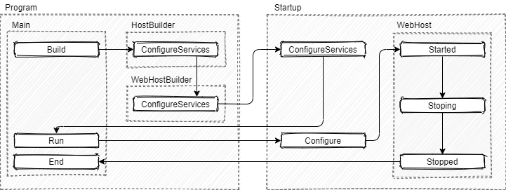
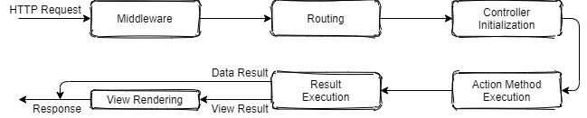
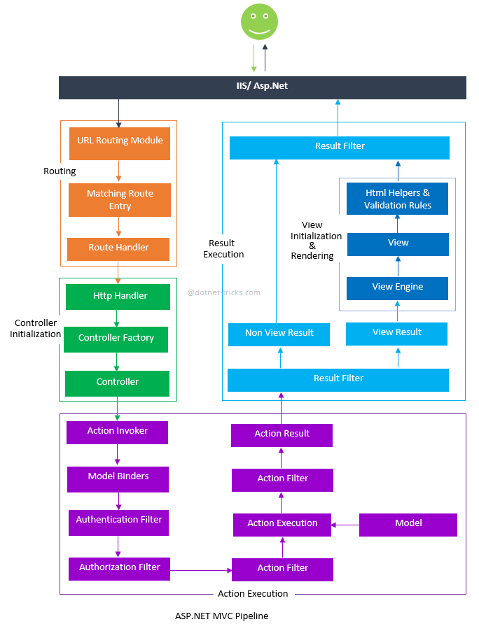
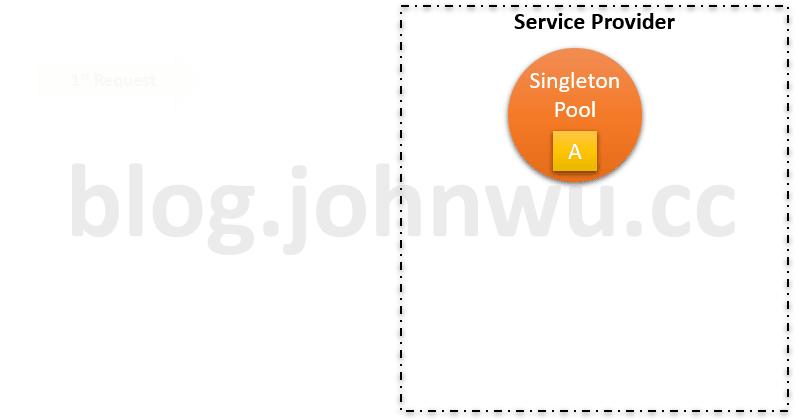
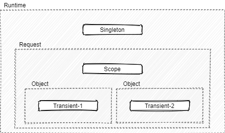

# .NET Core 應用程式生命週期

對於任何應用程式框架而言，依據其依循的架構概念、設計用途，可以區分為兩種類型：

+ 被動運作的函式庫集
+ 主動運作的樣板框架

前者顧名思義就是提供一個針對特定演算法的函式庫集，例如 OpenCV，後者是提供一個框架進入點，並依據編寫的類別、行為，來完整運作後的成果；而 .NET Core 應用程式便是一種主動運作的樣板框架，而此類樣板框架的運用原則，便是提供開發人員一系列的類別繼承 ( Inheritance )、行為覆載 ( Override )，框架則基於此樣板的演算原則來觸發類別與行為，而這個演算原則便稱呼為應用程式生命週期；對於可進行編譯的語言，具體可分為兩種生命週期：

+ 編譯生命週期：程式在編譯前會依據設定對引入專案與設定專案有關的處理週期，主要用於 CI/CD 與相關整合設計
+ 執行生命週期：軟體編譯後並執行，在啟動其服務至收到需求並執行的處理週期，依據語言、框架將會存在複數的週期設計

## 應用程式生命週期

基於文獻所述，ASP.NET MVC Core 約莫存在三個生命週期：

+ 初始應用週期
+ 需求處理週期
+ 相依注入週期

### 初始應用週期

.NET Core 應用程式為一個標準 Web 伺服器服務，因此再啟動並初始一個基於 .NET 的伺服器服務會如下圖程序步驟執行：



在 .NET 專案的程式進入點 ```Main()``` 中可以看到一句服務建置步驟：

```
CreateHostBuilder(args).Build().Run();
```

而這句可以分解為下列三句，並分別對應在上圖的建置、執行的程序：

```
var hostBuilder = CreateHostBuilder(args);
var host = hostBuilder.Build();
host.Run();
```

在建置程序中，開發人員需定義 ```Startup``` 中的 ```ConfigureServices``` 以此設定服務的相依注入設定，而關於 ```HostBuilder```、```WebHostBuilder``` 則是用於定義服務建置工具，主要會用於動態建置程序與基礎服務設定。

在執行程序中，開發人員需定義 ```Startup``` 中的 ```Configure``` 以此設定需求處理週期中需執行的服務，需注意在此函數中的參數是相依注入近來，因此應依據管理需要而調整注入的參數。

### 需求處理週期

.NET Core 應用程式的依據版本的生命週期在其細節會有差異，詳細參考文獻連結，在此引用整理後的流程進行說明。



如上圖所示，ASP.NET MVC Request 生命週期：

+ Middleware

中間件 ( Middleware ) 在整個應用程式流程中，用於處理用戶定義的需求資訊前處理工作，設定於此的元件將會對每個進來的需求做統一的處理。

+ Routing

路由 ( Routing ) 是一個由 MVC 框架定義的中間件，此元件用於將需求分配到對應的控制器 ( Controller ) 與行為 ( Action )，而分配標準則依據約定路由 ( Convention routes ) 或屬性路由 ( Attribute routes )

+ Controller Initialization

初始化控制器，在此階段 MVC 框架會基於非同步任務 ( Task ) 來初始化控制器，並讓控制器處裡需求，但需注意，控制器會執行最接近需求的路由模板所對應的行為。

+ Action Method Execution

在完成控制器初始化並開啟任務後，MVC 框架便會執行行為並取得執行結果。

+ Resutl Execution

MVC 框架取回執行結果後，會依據回應物件分為資料結果、呈現結果，前者為 HTTP Response，後者會經過呈現繪圖 ( View Rendering ) 轉為 HTML Response。

<center>
    
</center>

> from [Detailed ASP.NET MVC Pipeline](https://www.dotnettricks.com/learn/mvc/detailed-aspnet-mvc-pipeline)

詳細生命週期處裡細節可參考上圖所示內容，而對開發人員來說，實務設計會著重在：

+ Middleware，設計全域行為
+ Action，區域過濾器、行為邏輯設計
+ Result，回應格式、頁面設計

### 相依注入週期

.NET Core 應用程式其架構原則中有一項規範『相依性反轉』，因此，在整個服務的設計原則中有大量的相依注入 ( Dependency Injection )，其運作週期如下：

<center>
    
</center>

> from [ASP.NET Core 3 系列 - 依賴注入 (Dependency Injection)](https://blog.johnwu.cc/article/asp-net-core-3-dependency-injection.html)

相依注入其觀念是避免在編譯其決定物件間的關係性，讓物件的關係留待執行階段再指定，以此達到類別的關係解耦；其優點是讓物件的關係更為靈活，亦可基於設定改寫關係定義並有原則的抽象類別，其缺點則是物件生成關係是隱含在框架生命週期中，閱讀與維護性會受知識與觀念影響。



而依據前文所述，開發人員在 ```Startup``` 中的 ```ConfigureServices``` 定義的相依注入，其定義時會需指定注入物件的生命週期，範圍如上圖所示：

+ Transient : 每次請求時都會產生新的 Instance

每個物件生成並依據類別定義注入物件時，會對框架產生一次注入請求，指定為 ```Transient``` 的物件，在請求時便會生成一個 Instance。

+ Scoped : 每個 Request 都會產生一份 Instance

伺服器收到請求 ( Request ) 從而建立控制器、服務，在這請求執行過程中，指定為 ```Scoped``` 的物件，則會在此間僅有一個 Instance。

+ Singleton : 整個 Application 只會有一份 Instance

應用服務在建立、啟動、關閉期間，指定為 ```Singleton``` 的物件，僅會存在一個 Instance，相當於全域物件。

實務上，注入物件取回共有三種方式：

1. Constructor，物件建構式，相當於在物件生成時由系統注入，用於 Controller、Middleware 由系統生成時注入
2. Invoke ( Action ) parameter，調用參數，在物件行為經由系統調用時由系統注入，用於 Controller.Action、Middleware.Invoke 由系統調用時注入
3. HttpContext.RequestServices，經由 HttpContext 調回服務，在執行服務的商業邏輯中調用指定型態的服務

需注意 Controller、Middleware 在方式 2、3 會因為框架處理方式在寫法上有所不同，此外 3 則是在不同版本間有不同的寫法，詳細參考後續文獻提供連結內容或另外查詢。

### 文獻

+ [Lifecycle of an ASP.NET MVC 5 Application](https://docs.microsoft.com/en-us/aspnet/mvc/overview/getting-started/lifecycle-of-an-aspnet-mvc-5-application)
    - [ASP.NET MVC 5 Application lifecycle PDF](https://docs.microsoft.com/en-us/aspnet/mvc/overview/getting-started/lifecycle-of-an-aspnet-mvc-5-application/_static/lifecycle-of-an-aspnet-mvc-5-application1.pdf)
    - [ASP.NET Application Life Cycle Overview for IIS 7.0](https://docs.microsoft.com/en-us/previous-versions/bb470252(v=vs.140))
        + [ASP.NET Core 3 系列 - 程式生命週期 (Application Lifetime)](https://blog.johnwu.cc/article/asp-net-core-3-application-lifetime.html)
    - [ASP.NET Core MVC Request Life Cycle](https://www.c-sharpcorner.com/article/asp-net-core-mvc-request-life-cycle/)
        + [ASP.NET Core MVC Request Life Cycle](https://www.c-sharpcorner.com/article/asp-net-core-mvc-request-life-cycle/)
        + [淺談 ASP.NET MVC 的生命週期](https://nwpie.blogspot.com/2017/05/5-aspnet-mvc.html)
        + [ASP .NET Core MVC 生命週期](https://ithelp.ithome.com.tw/articles/10242725)
        + [ASP.NET Core in Action - What is middleware?](https://andrewlock.net/asp-net-core-in-action-what-is-middleware/)
    - [ASP.NET Core DI 生命週期 LifeTime](https://marcus116.blogspot.com/2019/04/netcore-aspnet-core-di-lifetime.html)
        + [ASP.NET Core 3 系列 - 依賴注入 (Dependency Injection)](https://blog.johnwu.cc/article/asp-net-core-3-dependency-injection.html)
        + [ASP.NET Core Dependency Injection Deep Dive](https://joonasw.net/view/aspnet-core-di-deep-dive)
        + [.net core 2.1 DI (dependency injection)的三種注入方式有什麼不同嗎?](https://ithelp.ithome.com.tw/questions/10201262)

## Middleware、Filters、Models


### 文獻

+ [Middleware vs Filters ASP. NET Core](https://www.edgesidesolutions.com/middleware-vs-filters-asp-net-core/)
    - [Filter 和 Middleware](https://www.dotblogs.com.tw/Null/2020/03/19/120500)
    - Middleware
        + [ASP.NET Core 中介軟體](https://docs.microsoft.com/zh-tw/aspnet/core/fundamentals/middleware/?view=aspnetcore-3.1)
        + [撰寫自訂的 ASP.NET Core 中介軟體](https://docs.microsoft.com/zh-tw/aspnet/core/fundamentals/middleware/write?view=aspnetcore-5.0)
        + [ASP.NET Core 基礎 - Middleware](https://blog.darkthread.net/blog/aspnetcore-middleware-lab/)
        + [.Net Core Project 從零開始 — Middleware的概念與應用](https://medium.com/@WilliamWhetstone/net-core-project-%E5%BE%9E%E9%9B%B6%E9%96%8B%E5%A7%8B-middleware%E7%9A%84%E6%A6%82%E5%BF%B5%E8%88%87%E6%87%89%E7%94%A8-cb426045050e)
    - Filters
        + [ASP.NET Core 中的篩選條件](https://docs.microsoft.com/zh-tw/aspnet/core/mvc/controllers/filters?view=aspnetcore-3.1)
        + [ASP.NET Core MVC 過濾器介紹](https://www.twblogs.net/a/5c76851bbd9eee339918009c)
    - Models
        + [在 ASP.NET Core 中使用應用程式模型](https://docs.microsoft.com/zh-tw/aspnet/core/mvc/controllers/application-model?view=aspnetcore-3.1)

## 驗證與授權

### 文獻

+ [ASP.NET Core 驗證的總覽](https://docs.microsoft.com/zh-tw/aspnet/core/security/authentication/?view=aspnetcore-3.1)
+ [ASP.NET Core 的授權簡介](https://docs.microsoft.com/zh-tw/aspnet/core/security/authorization/introduction?view=aspnetcore-3.1)
    + [ASP.NET Core 中以角色為基礎的授權](https://docs.microsoft.com/zh-tw/aspnet/core/security/authorization/roles?view=aspnetcore-3.1)
    + [ASP.NET Core 中以宣告為基礎的授權](https://docs.microsoft.com/zh-tw/aspnet/core/security/authorization/claims?view=aspnetcore-3.1)
    + [ASP.NET Core 中以原則為基礎的授權](https://docs.microsoft.com/zh-tw/aspnet/core/security/authorization/policies?view=aspnetcore-3.1)
